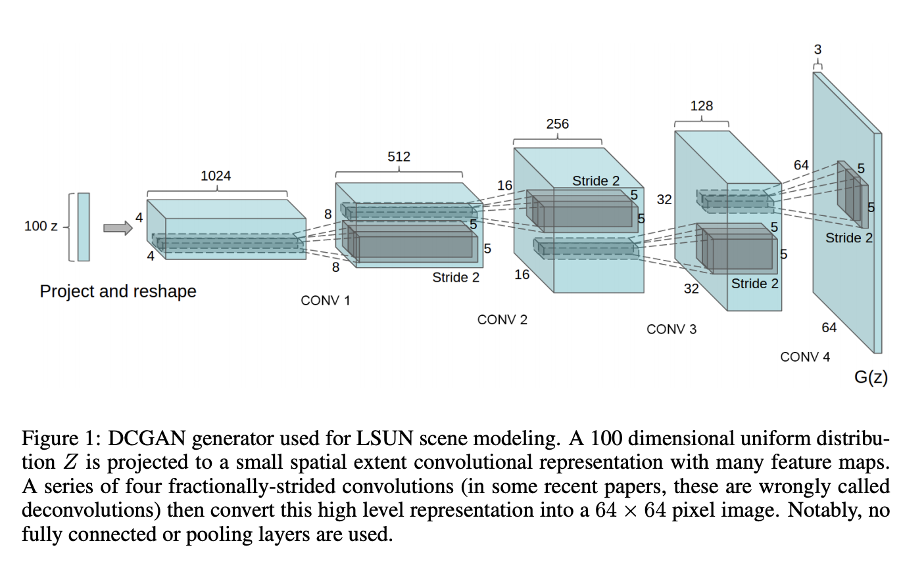
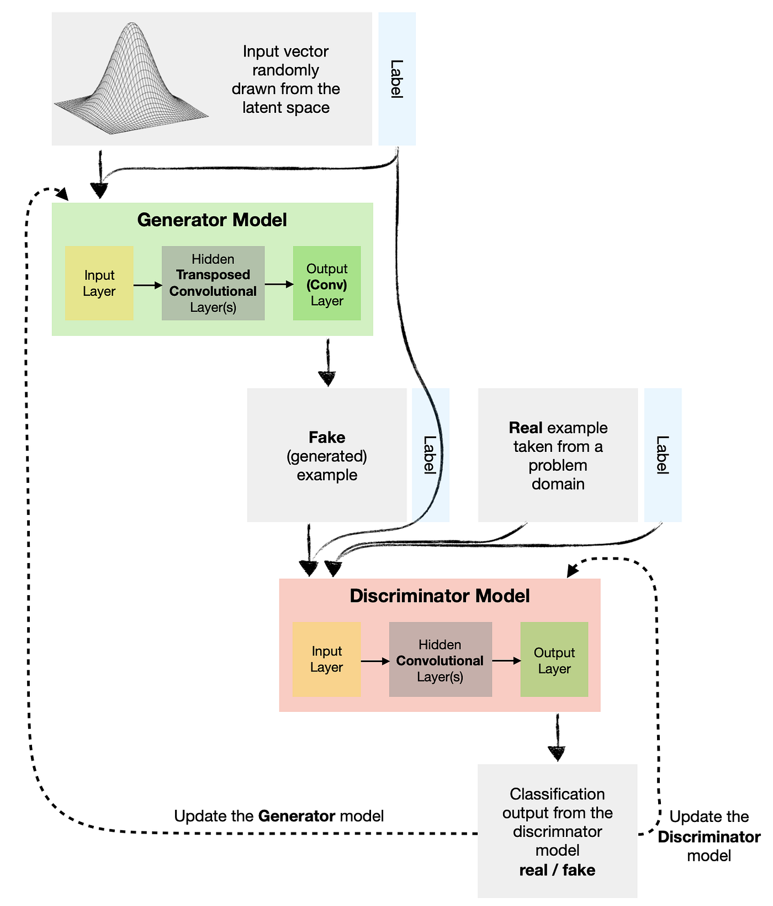
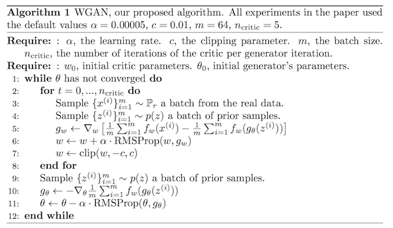
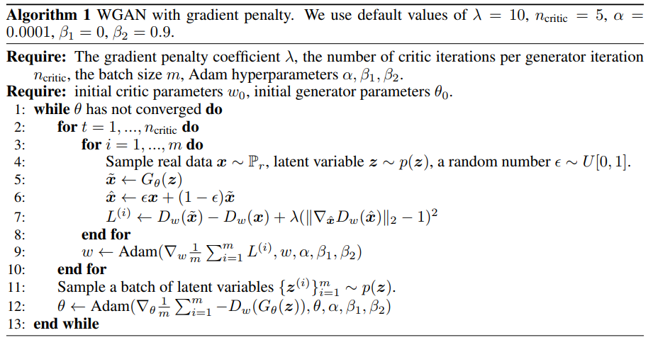

# GAN Implementations in PyTorch

Welcome to the GAN Implementations repository in PyTorch! This repository contains a collection of Generative Adversarial Network (GAN) implementations using the PyTorch framework.

## What is a GAN?

GANs are a class of deep learning models used for generative modeling tasks. They consist of two components: a generator network and a discriminator network. The generator aims to generate realistic data samples (e.g., images, text) from random noise, while the discriminator tries to distinguish between real data and fake/generated data. Through an adversarial training process, the generator learns to generate increasingly realistic samples, while the discriminator improves its ability to distinguish between real and fake data.

## Repository Structure

This repository is organized into separate directories, each containing the implementation of a specific GAN model. The implemented GAN models include:

- Conditional GAN
- Deep Convolutional GAN (DCGAN)
- and more!

Additionally, a colab version of each GAN is available in the Notebooks directory.

Each directory typically includes the following files:

- `generator.py`: Contains the implementation of the Generator in GAN model architecture.
- `discriminator.py`: Contains the implementation of the Discriminator in GAN model architecture.
- `train.py`: Implements the training loop for the GAN model.
- `utils.py`: Provides utility functions for weight initialization.
- `README.md`: Includes detailed instructions on how to run and use the specific GAN model.

## Getting Started

To get started, clone this repository to your local machine:

```bash
git clone https://github.com/yasho191/GANs.git
```

### Dependencies

The following dependencies are required to run the GAN implementations:

```bash
- Python 3.9 or Above
- PyTorch
- Torchvision
- NumPy
- Matplotlib
```

Make sure you have PyTorch and the required dependencies installed. You can install the dependencies using the following command:

```bash
pip install -r requirements.txt
```

Then, navigate to the directory of the GAN model you want to explore and follow the instructions provided in the respective `README.md` file.

### Training a Model

Navigate to the folder of the model you want to train and run the train.py file

```bash
cd GAN_Name
python3 train.py -d [DATA_DIR] -m [MODEL_PATH] -a [ANIMATION_PATH] -t [TRAINING_CURVE_PATH]
```

The Jupyter Notebook version of each GAN training is present in the Notebooks directory.

## DCGAN



DCGAN (Deep Convolutional Generative Adversarial Networks) is a type of Generative Adversarial Network (GAN) architecture that utilizes deep convolutional neural networks for generating realistic synthetic data, particularly focused on image generation tasks. DCGANs have shown remarkable success in producing high-quality and visually appealing images across various domains.

The official research paper on DCGAN titled "Unsupervised Representation Learning with Deep Convolutional Generative Adversarial Networks" by Alec Radford, Luke Metz, and Soumith Chintala can be found at the following link: [DCGAN Research Paper](https://arxiv.org/abs/1511.06434)

**DCGAN Training Results: (Cartoon 100k Dataset was used for training) - 60 epochs**

https://github.com/yasho191/GANs/assets/54347711/4d9e5b1f-3859-4933-af94-b1b9c42b0639

## CGAN



Conditional Generative Adversarial Networks (CGANs) are an extension of the original Generative Adversarial Networks (GANs) that incorporate additional conditioning information to control the generated outputs. In CGANs, both the generator and discriminator are conditioned on additional input variables, such as class labels or other forms of auxiliary information.

The CGAN framework introduces the concept of "conditional" in the GAN architecture by concatenating the conditioning information with the input noise vector for the generator and with the input real or generated samples for the discriminator. This conditioning information acts as additional input to guide the generation process and improve the quality and control of the generated samples.

The original research paper, "Conditional Generative Adversarial Nets" by Mehdi Mirza and Simon Osindero can be found at the following link: [CGAN Research Paper](https://arxiv.org/abs/1411.1784)

**CGAN Training Results: (Hindi-MNIST Dataset was used for training) - 5 epochs**

https://github.com/yasho191/GANs/assets/54347711/534b0db3-9947-4db1-b650-318be207ed76

## WGAN



The main motivation behind WGAN is to address some of the challenges and limitations of the original GAN formulation, such as mode collapse, training instability, and difficulties in measuring the convergence of the generator and discriminator. WGAN introduces the Wasserstein distance (also known as Earth Mover's Distance) as a more informative metric for comparing probability distributions.

The WGAN paper introduces additional techniques, such as weight clipping and gradient penalty, to enforce the Lipschitz constraint and improve training stability further.

The original research paper, "Wasserstein GAN" by Martin Arjovsky, Soumith Chintala, Léon Bottou
published in International Conference on Machine Learning (ICML), 2017 can be found here: [WGAN Research Paper](https://arxiv.org/abs/1701.07875)

**WGAN Training Results: (Cartoon 100k Dataset was used for training) - 30 epochs**

https://github.com/yasho191/GANs/assets/54347711/579172be-abe7-43f3-aa64-7164065baf65

## WGAN-GP



Wasserstein Generative Adversarial Network with Gradient Penalty (WGAN-GP) is an extension of the original WGAN framework, proposed by Ishaan Gulrajani et al. in their research paper titled "Improved Training of Wasserstein GANs" (2017). In the original WGAN, the Wasserstein distance is used as a metric to guide the training of the generator and discriminator networks. WGAN-GP further improves upon this by introducing a gradient penalty term to address some of the issues faced in training GANs, such as mode collapse and instability.

The official research paper "Improved Training of Wasserstein GANs" by Ishaan Gulrajani, Faruk Ahmed, Martin Arjovsky, Vincent Dumoulin, and Aaron C. Courville, published in Advances in Neural Information Processing Systems 30 (NIPS 2017) can be found here: [WGAN GP Research Paper](https://doi.org/10.48550/arXiv.1704.00028)

**WGAN-GP Training Results: (Cartoon 100k Dataset was used for training) - 30 epochs**

https://github.com/yasho191/GANs/assets/54347711/d80ac0b9-7ced-4a58-9222-3c8b12d53f8c

## Upcoming GANS

1. pix2pix
2. InfoGAN
3. Style GAN
4. CycleGAN

## License

The code in this repository is licensed under the [Apache 2.0 License](LICENSE).

## Acknowledgments

This repository is inspired by the fantastic work in the field of GANs and PyTorch. We would like to express our gratitude to the researchers and developers who have contributed to the advancements in GAN models and their implementations.

Enjoy exploring and experimenting with GANs in PyTorch!
